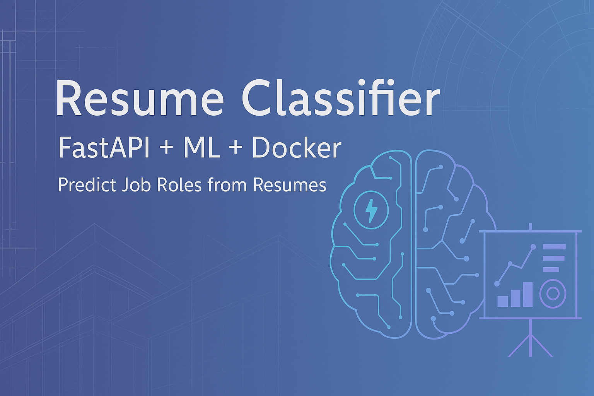

# 🧠 Resume Classifier – ML Web App (FastAPI + Streamlit + Docker + Render)

This project is a **machine learning-powered web application** that predicts the **job-fit category** of uploaded resumes (PDFs) using natural language processing (NLP).

It’s built with:
- 🔍 **Scikit-learn** for training a resume classifier
- ⚡ **FastAPI** for creating a lightweight backend API
- 🎨 **Streamlit** for an interactive frontend UI
- 🐳 **Docker** for containerization
- 🌐 **Render** for live cloud deployment

---

## 🌐 Live App

- 🎨 **Frontend UI**: [https://resume-streamlit-ui.onrender.com](https://resume-streamlit-ui.onrender.com)  
- ⚙️ **API Docs**: [https://resume-classifier-c1ub.onrender.com/docs](https://resume-classifier-c1ub.onrender.com/docs)

> Upload a resume PDF and get an instant prediction of its best-fit job category.

---

## 🚀 Features

- Upload **PDF resumes**
- Automatically extracts text using **PyMuPDF**
- Predicts the candidate's likely role:
  - `Data Scientist`, `Web Developer`, `Business Analyst`, etc.
- RESTful API served with FastAPI
- Interactive frontend built in Streamlit

---

## 🛠️ Tech Stack

| Layer            | Tools                         |
|------------------|-------------------------------|
| Machine Learning | Scikit-learn, TfidfVectorizer |
| Backend API      | FastAPI, Uvicorn              |
| PDF Parsing      | PyMuPDF                       |
| Frontend UI      | Streamlit                     |
| Deployment       | Docker, Render                |

---

## 📁 Project Structure

resume-classifier/ ├── app/ # FastAPI backend ├── model/ # Saved ML model + vectorizer ├── streamlit-app/ # Streamlit frontend │ ├── app.py │ ├── requirements.txt │ └── Dockerfile ├── train_model.py # Model training script ├── requirements.txt ├── Dockerfile # For FastAPI backend └── README.md


---

## ⚙️ Local Setup

### 🔧 Backend (FastAPI)

```bash
# Install dependencies
pip install -r requirements.txt

# Train model
python train_model.py

# Run FastAPI
uvicorn app.main:app --reload

Open: http://localhost:8000/docs

Frontend (Streamlit)

cd streamlit-app
pip install -r requirements.txt
streamlit run app.py

Open: http://localhost:8501

📦 Docker Deployment (Optional)
Both frontend and backend are containerized.
# Build and run FastAPI
docker build -t resume-api .
docker run -p 8000:8000 resume-api

# Build and run Streamlit UI
cd streamlit-app
docker build -t resume-ui .
docker run -p 8501:8501 resume-ui
```

👨‍💻 Author Abishek Ravichandiran Aspiring ML Engineer | CSE + Business Analytics 

🔗 LinkedIn https://www.linkedin.com/in/abishek316/ 

📬 abishekravichandiran7@gmail.com


⭐️ Show Your Support
If you found this useful, please ⭐️ the repo and share it!